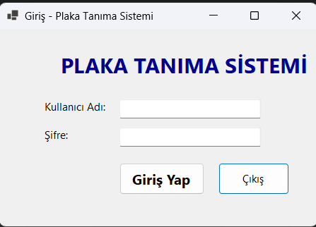
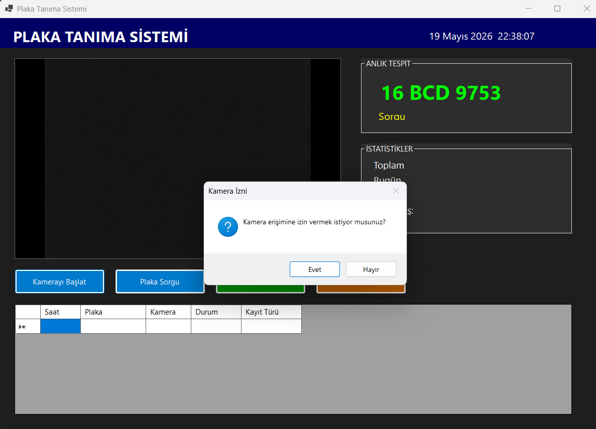
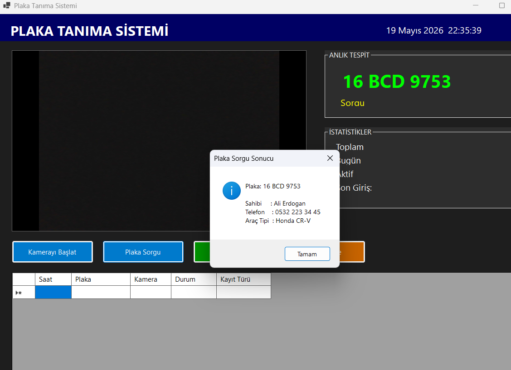
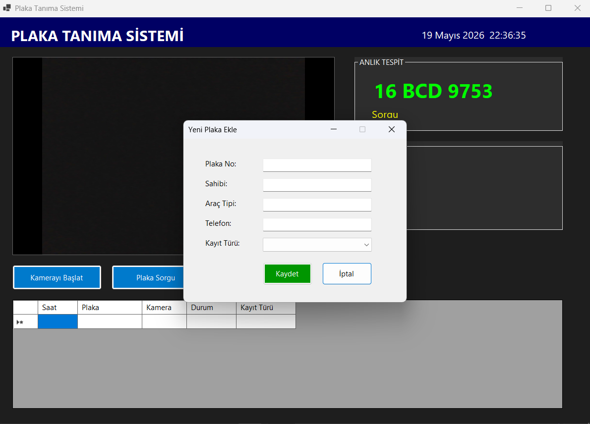
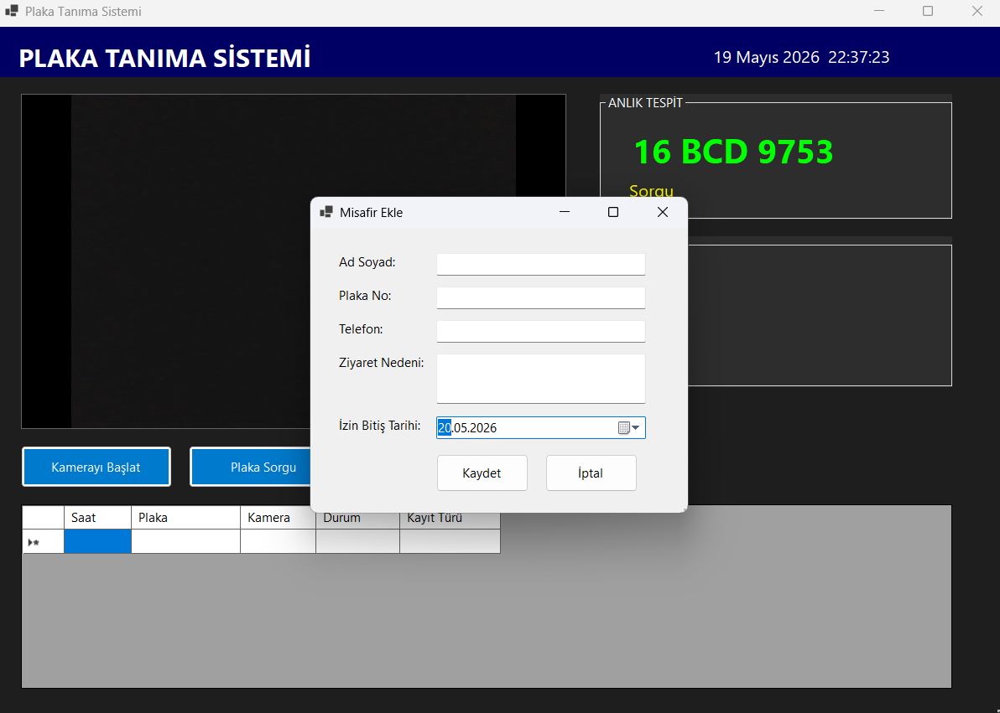

# Plaka Tanıma Sistemi

Türk plakaları otomatik olarak tanıyan ve kayıt altına alan bir masaüstü uygulamasıdır. Sistem yapay zeka teknolojileri kullanarak araç plakaları üzerindeki bilgileri işleyip veritabanına kaydeder.

## Özellikler

- Gerçek zamanlı plaka tanıma ve analizi
- Veritabanı entegrasyonu ile veri saklama
- Kullanıcı dostu arayüz
- SQL Server desteği
- Çoklu plaka tanıma yeteneği

## Ekran Görüntüleri

### Ana Arayüz


### İşlem Ekranı 1


### İşlem Ekranı 2


### Detay Görünümü


### Raporlama


## Teknoloji Yığını

- **Dil**: C#
- **Veritabanı**: SQL Server
- **Platform**: Windows Masaüstü Uygulaması
- **Framework**: .NET

## Kurulum

1. Projeyi klonlayın:
```bash
git clone https://github.com/Mahmutgovce/PlakaTanimaSistemi.git
cd PlakaTanimaSistemi
```

2. Çözümü Visual Studio'da açın (PlakaTanimaSistemi.slnx)

3. Gerekli NuGet paketlerini yükleyin


## Veritabanı

Veritabanı yapılandırması için proje köküne eklenen SQL script dosyaları kullanılır. Tablolar, ilişkiler ve başlangıç verileri bu dosyalarla otomatik olarak oluşturulur.

## Proje Yapısı

```
PlakaTanimaSistemi/
├── aaaaaa/
│   └── PlakaTanimaSistemi.csproj
├── SQLQuery1-6.sql (Veritabanı komut dosyaları)
├── PlakaTanimaSistemi.slnx (Çözüm dosyası)
└── README.md
```

## Kullanım

1. Uygulamayı başlatın
2. Plaka tanıma işlemini başlatın
3. Tanınan plakaları görüntüleyin
4. Bilgileri veritabanına kaydedin
5. Raporları oluşturun ve dışa aktarın

